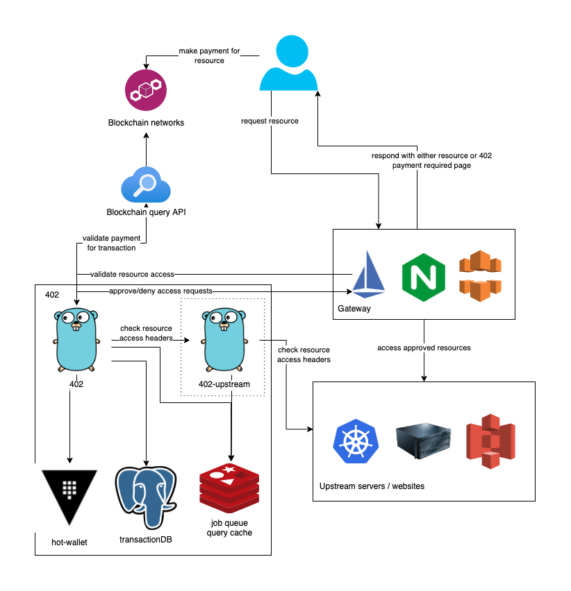

# 402

[RFC 7231](https://datatracker.ietf.org/doc/html/rfc7231#section-6.5.2) reserves the HTTP 402 status code "for future use". _That future is now._

`402` aims to be the first feature-complete implementation of the HTTP 402 specification, without the need to rely on any other party.

Furthermore, `402` shifts the burden of web payments from individual developers to a common interface. Developers are able to customize the payment interface with additional stylesheets and scripts, but are not responsible for any of the traditional payment flow process.

## Architecture



`402` operates as a sidecar middleware service, independent of whatever upstream services are configured. `402` can be integrated into existing network gateway frameworks such as Istio, NGINX, and CloudFront to immediately enable `402` on resources without any significant infrastructure changes. See [./devops/middleware](./devops/middleware) for configuration examples.

While the client/server flow is entirely stateless, `402` itself relies on Postgres, Redis, and HashiCorp Vault for internal state handling.

### Database

Transaction history is stored in Postgres. This enables tracking / analyzing transactions, as well as ensures "double dipping" is prevented.

### Cache & Pub Sub

Upstream request header caching, job scheduling queues, and successful transaction notification pubsub is handled through Redis. This decoupling of internal memory and compute enables `402` to scale horizontally without issue.

### Key Management

An optional but recommended feature, HashiCorp Vault enables secure key management for all payment address private keys. Instead of using a single static address for all transactions, with `VAULT_ENABLE=true` and a configured Vault instance, upstream resources can spec a payment request with an empty address field, and `402` will create a dynamic address on the fly. This ensures that each transaction gets a dedicated address, and makes it much more difficult to track received transactions from the outside. When a payment is completed, the address is updated in Vault to include the txid and network for easier tracking / export later.

## Enabling 402 on a Site

`402` currently requires two fields to be enabled. 

- `x-402-required`: `Boolean`
    - Set this field to true to indicate payment is required on this endpoint. As the `402` spec becomes more widedly adopted we hope to be able to phase this out in exchange for a more semantic response of `HTTP 402`.
- `x-402-request`: `String Base64 JSON`
    - This is the full payment request metadata. It is a base64 encoded stringified JSON `Meta` object. This must include the enabled networks, desired amount on each network, and the claims payment will grant. 

We plan to extend the spec in the future to make more use of the `x-402` namespace.

### Example Payment Request JSON

```json
{
    "claims": {
        "aud": "example.com",
        "resource": "/hello-world",
        "userLevel": "silver",
        "moreCustomClaims": "my-custom-data"
    },
    "exp": 6000000000000,
    "payment": {
        "requests": [
            {
                "network": "polygon",
                "address": "",
                "amount": 10
            }
        ]
    },
    "customization": {
        "css": "https://example.com/payment-style.css",
        "js": "https://example.com/payment-scripts.js",
        "image": "https://example.com/payment-image.png"
    }
}
```

### Configuration Methods

Each upstream must specify a configuration method. This is how `402` will communicate with the upstream to retrieve payment requirements and request metadata. Currently `http` and `html` methods are supported. For performance, `http` is the recommended approach when possible, however `html` enables `402` to be enabled on sites where you have limited or no control over the server infrastructure for your site.

#### http

Servers can enable `402` on an endpoint by sending the following headers when the resource is requested. `402` will make a `HEAD` request to a resource to determine if payment is required. `402` will cache the `HEAD` response to improve performance. The header cache can be purged by an administrator by issuing a `PURGE` request to the endpoint with a valid admin JWT.

##### Headers

`x-402-required: [Boolean]`
`x-402-request: [String Base64 JSON]`

#### HTML

Serverless / static sites can enable hpay on a resource by setting `<meta>` tags in the `HTML` content (preferrably in the `<head>`).

##### Meta Tags

```html
<meta name="x-402-required" content="[Boolean]">
<meta name="x-402-request" content="[String Base64 JSON]">
```

## Encryption

`402` utilizes `RSA` Public/Private key pairs to encrypt payment requests as well as generate JWTs for users. It is recommended to enable more than one private key to enable easier rotation in the future. While not necessary to integrate, `402` also exposes the active `JWKS` to enable additional validation integrations, such as Istio RequestAuthentication.

Based on the size of your claims, you will need to generate an adequately sized key to sign the payload.

Example key generation:

```bash
openssl genrsa -out example.key 6144
```

### Encrypted Checksum

Client/server communication with `402` is completely stateless and claims-based. When a client requests access to a resource, `402` will send the client an encrypted payload representing the `402` claims config from the upstream, along with a hashed checksum of the encrypted data. 

When a client sends a transaction to `402`, they must include the full encrypted data and meta hash along with the transaction data. `402` will validate the checksum matches the encrypted request before decrypting the request and processing for the user.

## Dynamic Address Management

If Vault is enabled, upstream sites can omit the `address` from the payment request, and `402` will create a new address in Vault for each transaction request.

When a payment is completed, `402` will update Value to add the `txid` and `network` to the address for easier accounting (as well as tracking the tx data in the database). Site owners can then retrieve the private keys from Vault as needed.

Future feature additions will include pooled re-usable receive addresses, and un-used address cleanup.